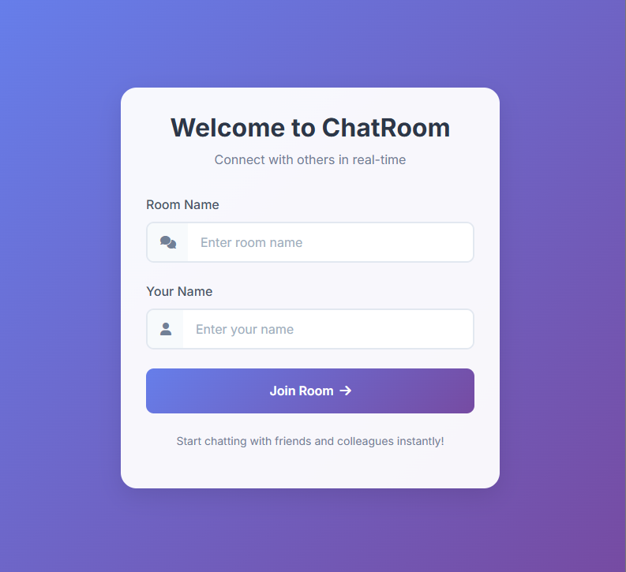
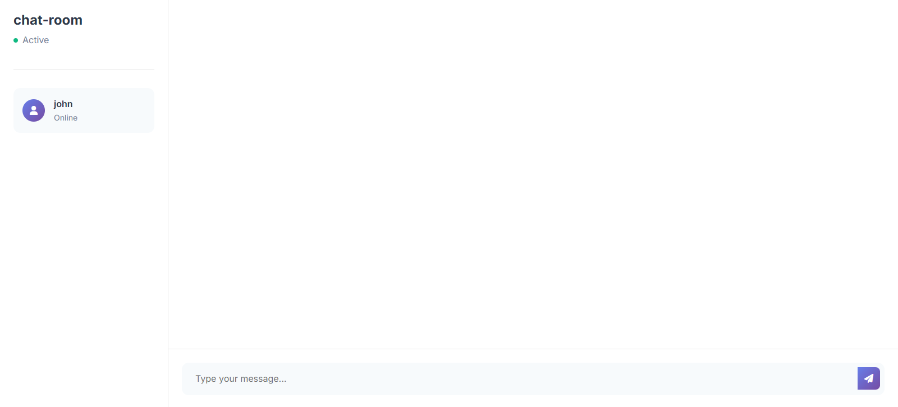
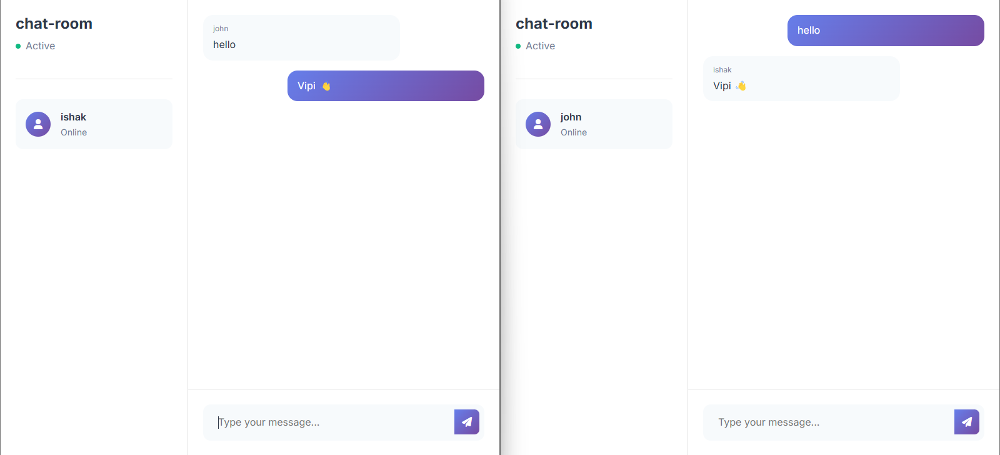

# Real-Time Django Chat Application

A real-time chat application built with Django and Django Channels, featuring WebSocket communication for instant messaging.

## Features

- Real-time messaging using WebSocket
- Multiple chat rooms
- User-friendly interface
- Mobile-responsive design
- Automatic reconnection handling
- Real-time typing indicators
- Message timestamps

## Screenshots

### Login Page

*Users can enter their name and choose a chat room*

### Chat Room Interface

*The main chat interface where users can send and receive messages*

### Live Chat Demo

*Multiple users chatting in real-time*

## Technology Stack

- Python 3.13
- Django 5.1.3
- Django Channels 4.1.0
- WebSocket
- HTML/CSS/JavaScript
- Bootstrap 5
- SQLite

## Installation

1. Clone the repository
```bash
git clone https://github.com/Is-haka/django_chat.git
cd django_chat
```

2. Create a virtual environment and activate it
```bash
python -m venv venv
source venv/bin/activate  # On Windows use: venv\Scripts\activate
```

3. Install dependencies
```bash
pip install -r requirements.txt
```

4. Run migrations
```bash
python manage.py migrate
```

5. Start the development server
```bash
python manage.py runserver
```

6. Visit http://localhost:8000 in your browser

## Usage

1. Open the application in your web browser
2. Enter your desired username and room name
3. Start chatting!
4. Open another browser window and join the same room with a different username to test real-time chat

## Project Structure

```
django_v1/
├── chat/                   # Main chat application
│   ├── consumers.py       # WebSocket consumer
│   ├── routing.py         # WebSocket routing
│   ├── urls.py           # URL configurations
│   └── views.py          # View functions
├── config/                # Project configuration
│   ├── asgi.py           # ASGI configuration
│   ├── settings.py       # Project settings
│   ├── urls.py           # Main URL routing
│   └── wsgi.py           # WSGI configuration
└── templates/             # HTML templates
    ├── base.html         # Base template
    ├── index.html        # Login page
    └── room.html         # Chat room page
```

## Contributing

1. Fork the repository
2. Create your feature branch (`git checkout -b feature/AmazingFeature`)
3. Commit your changes (`git commit -m 'Add some AmazingFeature'`)
4. Push to the branch (`git push origin feature/AmazingFeature`)
5. Open a Pull Request
